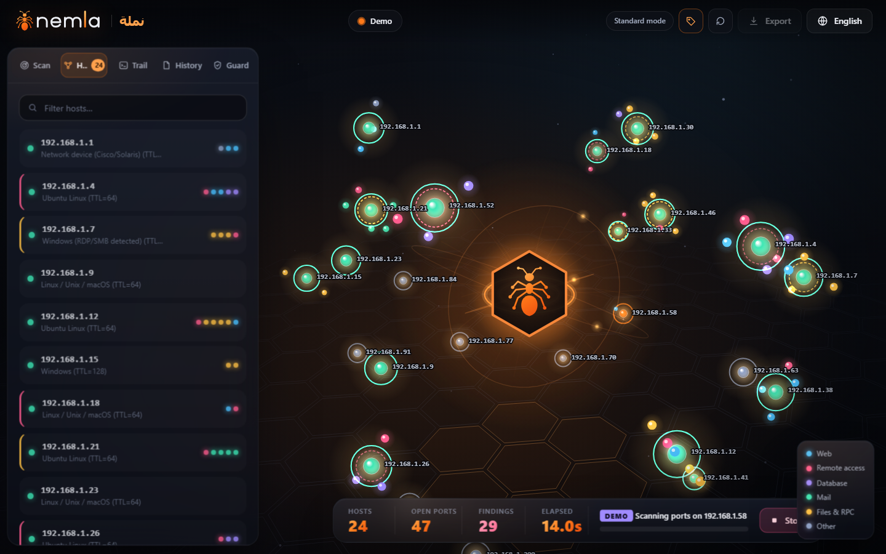

<div dir="rtl">

# 🐜 نملة (Nemla) — منصّة خفيفة لاستطلاع الشبكات وتحليل الخدمات والمراقبة الدفاعية

**اكتشاف · فحص · تحديد الخدمات · تقييم · تقرير · مراقبة**

[English](README.md) · **العربية** · [עברית](README.he.md)

نملة منصّة صغيرة لاستطلاع الشبكات مكتوبة بلغة Python، **بدون أي مكتبات إضافية مطلوبة**. أعطها عنوان IP (نسخة 4 أو 6)، أو اسم موقع، أو نطاق، أو شبكة كاملة، فتكتشف الأجهزة الشغّالة، وتفحص منافذ TCP وUDP، وتحدد الخدمة اللي ورا كل منفذ مفتوح (المنتج، النسخة، شهادة TLS، تفاصيل البروتوكول)، وتخمّن نظام التشغيل من عدة إشارات مستقلة، وبتحوّل اللي شافته لـ **ملاحظات مبنية على أدلة** مع درجة ثقة وطريقة إصلاح. بتكتب التقارير بصيغ **HTML وJSON وCSV وMarkdown وSARIF**، وبتتذكر فحوصاتك وبتقلك شو تغيّر، وبتقدر تحرس الشبكة من النشاط المشبوه. كل شي متوفر **بالعربي والإنجليزي والعبري**: بسطر الأوامر، وبالتقارير، وبواجهة ويب ثلاثية الأبعاد.

## شو الجديد بالإصدار 2.0

- **أوامر أقصر.** `nemla 192.168.1.10` بدل `nemla -t 192.168.1.10`؛ و`nemla watch` و`nemla diff` و`nemla guard` و`nemla ui` للأوضاع؛ و`-p all` لكل المنافذ. وكل خيارات 1.x لسا شغّالة.
- **معمارية حقيقية.** ملف `nemla.py` الواحد (1,900 سطر) صار حزمة `nemla/`: الأهداف، الاكتشاف، مجدوِل محدود، فاحصات TCP وUDP، إضافة صغيرة لكل بروتوكول، تخمين النظام، الملاحظات، التقارير، السجل، والحراسة. الأمر `python3 nemla.py ...` و`import nemla` بيضلّوا شغّالين. شوف [docs/architecture.md](docs/architecture.md).
- **IPv6** بكل مكان (الأهداف، الفحص، الاكتشاف، التقارير، السجل، الواجهة).
- **فحص UDP** بحالات صادقة: `open` و`closed` و`open|filtered` و`unknown`، بمعدّل محدود وبشكل آمن.
- **تحديد الخدمات كإضافات:** HTTP/HTTPS وSSH (مع الخوارزميات اللي بيعرضها الخادم) وFTP وSMTP وPOP3 وIMAP وDNS وRedis وMemcached وMySQL/MariaDB وPostgreSQL وRDP (مع NLA) وSMB (SMBv1 والتوقيع) وTelnet وVNC، مع تحليل TLS والشهادات بقارئ X.509 خاص بنملة.
- **ثقة بكل مكان.** كل نتيجة خدمة أو نظام معها درجة ثقة ودليلها. والتخمين من رقم المنفذ لحاله بينكتب إنه تخمين.
- **محرّك ملاحظات بيوري شغله:** المعرّف، الخطورة، العنوان، الوصف، الدليل، الجهاز، المنفذ، الإصلاح، والثقة، بثلاث لغات.
- **التقارير:** ملخص تنفيذي، بيانات الفحص، الأخطاء والتحذيرات، مع Markdown وSARIF 2.1.0.
- **دقة وسرعة:** خيارات متحقَّق منها، مجدوِل ما بيكدّس عشرات الآلاف من المهام، حدود عامة وحدود لكل جهاز، تحديد معدّل، ميزانية فحوصات، وإلغاء بيشتغل خلال عُشر ثانية.
- **تقوية أمنية** للسيرفر المحلي والتقارير والسجل والـ launcher، مع اختبار لكل إصلاح. شوف [الأمان](#الأمان).

## ليش نملة؟

أداة [nmap](https://nmap.org) أقوى بكثير وهي الخيار للشغل الجدي. نملة للحالات اللي بدك فيها شي أخف وأوضح بالشرح:

- **بدون تثبيت**: مكتبات بايثون القياسية فقط (Scapy اختيارية). بدون أجزاء مترجمة.
- **بتشرح حالها.** كل ملاحظة بتقلك شو انشاف، قديش نملة متأكدة، وشو تعمل.
- **ثقة صادقة.** نملة ما بتعرض تخميناً على إنه حقيقة.
- **تقرير جاهز للتسليم**: صفحة HTML داكنة وواضحة، أو Markdown وSARIF لأدواتك.
- **عربي وعبري**: خيار `--lang ar` أو `--lang he` بيحوّل سطر الأوامر والتقارير والواجهة (من اليمين لليسار).
- **كود مقروء**: بايثون عادي، وحدة صغيرة لكل بروتوكول. ممتاز لتتعلم كيف بتشتغل أدوات الفحص.

## المميزات

| المجال | شو بتعمل نملة |
| --- | --- |
| الأهداف | IPv4 وIPv6 (`2001:db8::/120`, `fe80::1%eth0`)، أسماء (`getaddrinfo`)، CIDR، نطاقات، وعدة أهداف مع بعض؛ بتتولّد بالتدريج، فمليون عنوان ما بيكلفوا ذاكرة |
| الاكتشاف | ARP (عبر Scapy، أو جدول الجيران بالنظام بدون root)، وبيكمّله فحص ICMP وTCP للعناوين اللي فاتها ARP |
| TCP | فحص اتصال متزامن عبر مجدوِل محدود، قراءة اللافتات، تحديد الخدمة |
| UDP | DNS وTFTP وRPCBind وNTP وNetBIOS وSNMP (المجتمع الافتراضي) وSSDP وmDNS وMemcached؛ بمعدّل محدود |
| الخدمات | المنتج والنسخة والثقة والدليل وحقائق البروتوكول (STARTTLS وNLA وتوقيع SMB وخوارزميات SSH الضعيفة...) |
| TLS | البروتوكول، الشفرة، صاحب الشهادة وجهة إصدارها وصلاحيتها، خوارزمية التوقيع، نوع المفتاح وحجمه، الموقّعة ذاتياً، وإذا TLS 1.0/1.1 لسا مقبولة |
| النظام | TTL، شكل SYN-ACK (يحتاج Scapy وroot)، اللافتات، المنافذ المفتوحة، حقائق البروتوكول، صانع كرت الشبكة؛ والنتيجة معها ثقة ودليل |
| الملاحظات | وصول إداري وعن بُعد ظاهر، بروتوكولات غير آمنة وبنص واضح، شهادات منتهية أو ضعيفة، TLS وSSH ضعيف، SNMP افتراضي، Redis/Memcached/Elasticsearch مفتوح، SMBv1، RDP بدون NLA، محلّلات أسماء مفتوحة، لوحات إدارة |
| التقارير | HTML وJSON وCSV (آمن من حقن الصيغ) وMarkdown وSARIF |
| السجل | معرّفات UUID، ملفات ذرّية وخاصة، مقارنة: أجهزة جديدة/مفقودة، منافذ فُتحت/أُغلقت (TCP وUDP)، تغيّر الخدمة والنسخة والنظام، ملاحظات جديدة ومحلولة |
| الحراسة | منافذ طُعم، أجهزة غير معروفة، تغيّرات ARP مع ثقة ودليل |
| الواجهة | خريطة مستعمرة ثلاثية الأبعاد، تقدّم مباشر، مفتّش مع الثقة والدليل، سجل، مقارنة، حالة الحراسة، عربي/إنجليزي/عبري |

## التثبيت

</div>

```bash
git clone https://github.com/hdada180/nmlah.git
cd nmlah
python3 nemla.py --help        # على ويندوز: python nemla.py --help
```

<div dir="rtl">

بباقي هالوثيقة، **`nemla` معناها `python3 nemla.py`** من هالمجلد (على ويندوز `python nemla.py`). وإذا ثبّتها كأمر (شوف تحت) بتصير فعلاً الأمر `nemla`.

اختياري، لاكتشاف ARP وبصمة SYN الخام (بدها root):

</div>

```bash
pip install scapy        # أو: pip install -r requirements.txt
```

<div dir="rtl">

وبتقدر تثبّتها كأمر: `pip install .` (أو `pip install ".[arp]"`)، وبعدين `nemla 192.168.1.10` (أو `python -m nemla 192.168.1.10`) من أي مجلد.

## بداية سريعة

تلات أوامر بتكفي للبداية:

</div>

```bash
nemla                                  # بيفتح الواجهة ثلاثية الأبعاد: اكتب الهدف واضغط ابدأ الفحص
nemla 192.168.1.10                     # فحص جهاز واحد: المنافذ الشائعة، الخدمات، تخمين النظام، الملاحظات، وتقرير
nemla 192.168.1.0/24                   # فحص شبكة كاملة
```

<div dir="rtl">

التقرير بينكتب باسم `nemla_report.html` بالمجلد الحالي (والخيار `-o` بيغيّر هاد). وبعدين ضيف بس اللي بتحتاجه:

</div>

```bash
nemla 192.168.1.10 -p 22,80,443        # هاي المنافذ بس (أو 1-1000، أو all)
nemla 192.168.1.10 --udp               # مع منافذ UDP الشائعة
nemla 2001:db8::5,192.168.1.10-20      # IPv6، وعدة أهداف مع بعض
nemla 192.168.1.10 --json scan.json    # حفظ JSON كمان (وبنفس الطريقة --csv و--md و--sarif)
nemla 192.168.1.0/24 --rate 50 --max-probes 5000    # فحص هادي: 50 اتصال بالثانية، وبحد أقصى 5000 فحص
nemla 192.168.1.10 --lang ar           # واجهة وتقرير بالعربي (و--lang he للعبري)
nemla 10.0.0.0/24 --fail-on high       # لأنظمة CI: رمز خروج 3 عند أي ملاحظة عالية
```

<div dir="rtl">

وباقي الأوضاع كل واحد بكلمة وحدة:

</div>

```bash
nemla watch 192.168.1.0/24 15m         # إعادة الفحص كل 15 دقيقة والإبلاغ عن اللي تغيّر
nemla diff yesterday.json today.json   # شو تغيّر بين فحصين محفوظين
nemla guard                            # مراقبة الشبكة من النشاط المشبوه
nemla ui                               # الواجهة ثلاثية الأبعاد (نفس تشغيل nemla بدون أي شي)
```

<div dir="rtl">

الصيغة القديمة لسا شغّالة: `nemla -t 192.168.1.10 --udp` هي نفسها `nemla 192.168.1.10 --udp`. والكلمات `scan` و`ui` و`guard` و`watch` و`diff` بتكون أوامر بس إذا كانت أول كلمة؛ وجهاز اسمه فعلاً `ui` بتفحصه هيك: `-t ui`.

الـ `sudo` مطلوب فقط لـ Scapy (طلبات ARP حقيقية، ICMP خام، بصمة SYN): `sudo python3 nemla.py 192.168.1.0/24`. بدونه بتقرأ نملة جدول الجيران بالنظام وبترجع لأمر `ping` وللاتصالات العادية.

## الخيارات

| الخيار | الوصف |
| --- | --- |
| `TARGET` (أو `-t TARGET`) | IP أو اسم أو CIDR أو `10.0.0.1-50` أو `10.0.0.1-10.0.0.50` أو IPv6؛ وعدة أهداف مفصولة بفواصل. `nemla 192.168.1.10` و`nemla -t 192.168.1.10` نفس الشي |
| `ui` و`guard` و`watch TARGET [EVERY]` و`diff OLD NEW` و`scan TARGET` | أول كلمة بالأمر: اختصار لـ `--ui` و`--guard` و`--watch EVERY -t TARGET` (كل 15 دقيقة إذا حذفت EVERY) و`--diff OLD NEW` وفحص عادي |
| `-4` / `-6` | حلّ الأسماء لـ IPv4 أو IPv6 فقط (الافتراضي: أول عنوان IPv4، وإلا أول IPv6) |
| `--all-addresses` | فحص كل عنوان بيحلّه الاسم |
| `-p`, `--ports` | `22` أو `22,80,443` أو `1-1000` أو `all` (كل المنافذ، 1-65535) أو خليط |
| `--top-ports` | فحص قائمة المنافذ الشائعة كمان (الافتراضي إذا ما حطيت `-p`) |
| `--udp` | فحص منافذ UDP الشائعة كمان |
| `--udp-ports LIST` | منافذ UDP للفحص (بيفعّل `--udp`) |
| `--udp-timeout S` / `--udp-rate PPS` | مهلة كل فحص UDP (افتراضي 1.0) / حزم بالثانية (افتراضي 200) |
| `-o`, `--output` | مسار تقرير HTML (افتراضي `nemla_report.html`) |
| `--json`, `--csv`, `--md`, `--sarif FILE` | كتابة النتائج بهاي الصيغة كمان |
| `--no-ping` | تخطي اكتشاف الأجهزة واعتبار كل الأهداف شغّالة |
| `--no-os` | تخطي تخمين النظام |
| `--no-banner` | تخطي قراءة اللافتات وتحديد الخدمات |
| `--intensity 0-9` | جهد تحديد الخدمات: 0 بدون، 5 افتراضي، 9 بيجرّب كل البروتوكولات |
| `--threads N` | الحد العام للفحوصات المتزامنة (افتراضي 150، وأقصى 2000) |
| `--per-host N` | حد الفحوصات المتزامنة على جهاز واحد (افتراضي 100) |
| `--timeout S` | مهلة اتصال TCP بالثواني، أكبر من 0 (افتراضي 0.7) |
| `--rate PPS` | تحديد محاولات اتصال TCP بالثانية (افتراضي بدون حد) |
| `--max-probes N` | التوقف بعد N اتصال/حزمة بالمجموع (افتراضي بدون حد) |
| `--max-hosts N` | رفض الأهداف الأكبر من N عنوان (افتراضي 1024، والحد الأعلى حوالي مليون) |
| `--fail-on LEVEL` | رمز خروج 3 إذا في ملاحظة بمستوى `low` أو `medium` أو `high` أو أعلى |
| `--watch INTERVAL` / `--watch-log FILE` | إعادة الفحص كل `90s` أو `15m` أو `2h` والإبلاغ عن التغييرات |
| `--diff OLD.json NEW.json` / `--fail-on-change` | مقارنة فحصين محفوظين؛ رمز 3 إذا ظهر شي جديد |
| `--guard` و`--guard-ports` و`--guard-interval` و`--guard-log` | المراقبة الدفاعية (تحت) |
| `--lang en\|ar\|he` | لغة سطر الأوامر والتقارير والواجهة |
| `-v`, `--verbose` | تفاصيل التصحيح على stderr |
| `--ui` و`--ui-port` و`--no-browser` و`--keep-alive` | الواجهة ثلاثية الأبعاد |
| `--install-launcher` / `--uninstall-launcher` | إدخال قائمة التطبيقات على لينكس |

رموز الخروج: `0` نجاح، `1` خطأ (هدف غير صالح، تقرير ما انكتب)، `2` معاملات خاطئة، `3` ملاحظات بمستوى `--fail-on` أو أعلى (أو تغييرات مع `--fail-on-change`).

## كيف بتشتغل

</div>

```
الأهداف -> الاكتشاف -> مجدوِل محدود -> فحص TCP / UDP
        -> تحديد الخدمات -> تخمين النظام -> الملاحظات -> التقارير
```

<div dir="rtl">

1. **الأهداف** بتصير مقاطع أرقام صحيحة بتطلّع عنوان عنوان (IPv4 وIPv6). والمنافذ بتنقرأ بعد التحقق من كل حد.
2. **الاكتشاف** بيبدأ بـ ARP على الشبكات الخاصة IPv4، وبعدين بيفحص كل عنوان ما ردّ عليه ARP بـ ICMP وTCP؛ والأجهزة اللي انلقت هيك بتاخد عنوان MAC من جدول الجيران. ARP ما بينحسب كامل أبداً، وبيطلع تحذير لما ما يكون كامل.
3. **المجدوِل** بيسحب المهام بالتدريج، وبيفرض الحد العام والحد لكل جهاز والمعدّل والميزانية، وبيوقف كل شي خلال عُشر ثانية لما تكبس Stop أو Ctrl+C. الأجهزة بتنفحص جنب بعض وكل جهاز بيخلص أول ما تخلص مهامه.
4. **تحديد الخدمات** بيقرأ أول شي اللي الخادم بيقوله لحاله، وبعدين بيسأل أسئلة خاصة بكل بروتوكول (إضافة لكل بروتوكول)، وبيجرّب TLS لما يكون محتمل وبيبص جواه. ولا شي بيسجّل دخول ولا بيغيّر حالة.
5. **تخمين النظام** بيجمع أصوات موزونة من TTL وSYN-ACK (النافذة والخيارات وDF) واللافتات والمنافذ المفتوحة وحقائق البروتوكول وصانع كرت الشبكة، وبيحتفظ بالدليل.
6. **الملاحظات** بتنطلع بس لما انشاف. ورقم المنفذ لحاله بيعطي ملاحظة بثقة أقل ودرجة خطورة أخف، ومكتوب عليها هيك.
7. **التقارير** بتنرسم من نفس البيانات بأي لغة.

### الثقة

كل نتيجة خدمة أو نظام معها `confidence` (من 0 لـ 1) وعلامة `heuristic`. اللافتة اللي بتسمّي المنتج والنسخة بتاخد حوالي 0.95، ورد بروتوكول سليم بدون نسخة حوالي 0.85، ورقم المنفذ لحاله 0.3 (`heuristic: true`). تخمين النظام سقفه 0.70 لما يعتمد على الاستنتاج بس، و0.92 لما خدمة تسمّي النظام بنفسها، لأن صاحب الجهاز بيقدر يعدّل اللافتات. ما في شي بينعرض كأنه مؤكد.

### الملاحظات

كل ملاحظة فيها `id` و`severity` و`title` و`description` و`evidence` و`host` و`port` و`proto` و`remediation` و`confidence`. أمثلة:

| الملاحظة | بتنطلع لما شافت نملة | الخطورة |
| --- | --- | --- |
| `telnet` و`ftp` و`mail_plain` و`smtp_plain_auth` و`basic_auth_plain` | خدمة أو تسجيل دخول بنص واضح على الشبكة | متوسطة لعالية |
| `redis_open` و`memcached` و`es_open` | ردّ على PING / `version` / `GET /` بدون مصادقة | عالية |
| `smb1` و`smb_signing` | قبول تفاوض SMBv1؛ التوقيع مش مطلوب | عالية / متوسطة |
| `rdp_no_nla` و`rdp_weak_security` | خادم RDP قبل جلسة بدون NLA / بأمان قديم | متوسطة / عالية |
| `tls_expired` و`tls_expiring` و`tls_not_yet_valid` | تواريخ الشهادة | عالية / متوسطة |
| `tls_old` و`tls_weak_sig` و`tls_weak_key` و`tls_selfsigned` | اكتمل اتصال TLS 1.0/1.1؛ توقيع SHA-1/MD5؛ RSA أقل من 2048 بت؛ صاحب الشهادة = المُصدِر | متوسطة / منخفضة |
| `ssh_protocol1` و`ssh_weak_crypto` | لافتة SSH-1؛ خوارزميات ضعيفة بعرض تبادل المفاتيح | عالية / متوسطة / منخفضة |
| `snmp_default` و`tftp` و`udp_exposed` | SNMP ردّ على `public`؛ TFTP ردّ؛ خدمة UDP قابلة للانعكاس على عنوان عام | متوسطة لعالية |
| `dns_recursion` | علامة RA بردّ DNS (محلّل مفتوح مجرد احتمال) | منخفضة لمتوسطة |
| `admin_panel` و`remote` و`db` و`files` | لوحة إدارة أو وصول عن بُعد أو قاعدة بيانات أو مشاركة ملفات ظاهرة | منخفضة لعالية |
| `http_plain` | تم فحص منافذ HTTP **و**HTTPS وما في ولا واحد بيقدّم TLS (أبداً بعد فحص المنفذ 80 لحاله) | منخفضة |

الظهور على عنوان عام (بيتحدد بـ `is_global`، فالفضاء المشترك ونطاقات التوثيق ما بتنحسب) بينحسب أخطر من الشبكة الخاصة. الملاحظات بتوصف الظهور والإعدادات الضعيفة، مش ثغرات قابلة للاستغلال: نملة ما بتطابق النسخ مع قاعدة CVE ولا بتحاول تسجّل دخول أو تستغل شي.

## التقارير

`--json` هو السجل الكامل (نسخة المخطط 2) وهو اللي بيحفظه السجل. بيحتفظ بكل حقول خرج 1.x. الـ CSV بيحتفظ بأعمدة 1.x أول شي (`ip,mac,vendor,os_guess,ttl,port,service,banner,product,version`) وبيضيف `proto,state,confidence,os_confidence`؛ والخلايا اللي ممكن تشتغل كصيغ جداول بتتعطّل. Markdown بيهرّب كل شي جاي من الشبكة. وSARIF 2.1.0 فيه قاعدة لكل معرّف ملاحظة ونتيجة لكل ملاحظة، والجهاز والمنفذ كموقع، للاستخدام مع GitHub code scanning وDefectDojo ولوحات مشابهة.

## شو تغيّر من آخر مرة

نملة بتتذكر فحوصاتك (آخر 60، بمجلد بيانات نملة، ولكل واحد UUID عشوائي) وبتقارن كل فحص جديد مع الفحص اللي قبله لنفس الهدف: أجهزة ظهرت أو اختفت، منافذ فُتحت أو أُغلقت (TCP وUDP)، خدمات تغيّر منتجها أو نسختها أو بروتوكولها، عائلة نظام تشغيل مختلفة، وملاحظات ظهرت أو انحلّت.

</div>

```bash
nemla 192.168.1.0/24 --json today.json
nemla diff yesterday.json today.json                   # أضف --fail-on-change للفحوصات المجدولة
nemla watch 192.168.1.0/24 15m --watch-log changes.jsonl
```

<div dir="rtl">

بالواجهة ثلاثية الأبعاد افتح تبويب **السجل** لتعيد فتح أي فحص محفوظ على الخريطة، وتشوف مقارنته مع الفحص اللي قبله، وتصدّره بأي صيغة.

## وضع الحراسة (دفاعي)

نملة بتقدر كمان تراقب شبكة بدل ما تفحصها:

- **منافذ طُعم.** منافذ ما في جهاز سليم عنده سبب يلمسها (2222 و2323 و5901 و8888 و3307 افتراضياً). أي شي بيتصل فيها هو بيجسّ شبكتك.
- **أجهزة غير معروفة.** أول فحص بيتعلّم أجهزتك بعنوان MAC؛ والجهاز اللي ما كان موجود قبل بيطلّع تنبيه (مع اسم صانعه إذا معروف).
- **تغيّرات ARP.** عنوان صار فجأة يردّ من جهاز مختلف.

تنبيهات الحراسة معها **درجة ثقة والدليل** ورا كل واحد. تغيّر ربط ARP **مش** دليل على انتحال: كرت شبكة اتبدّل أو تغيير DHCP أو جهاز افتراضي بيبانوا نفس الشي، فنملة بتوزن كون العنوان هو البوابة، وكم مرة الربط بيقلب، وإذا العنوان الجديد لجهاز معروف، وإذا القديم لسا بيردّ، وما بتتجاوز 0.85 أبداً. الحراسة بتراقب بس: ما بتهاجم ولا بتفحص أجهزة تانية ولا بتغيّر جدار الحماية (للجهاز اللي بدك تحجبه بتطبع الأمر بالضبط وبتترك تنفيذه إلك).

</div>

```bash
nemla guard
nemla guard --guard-log alerts.jsonl       # وكمان بيضيف كل تنبيه لملف
```

<div dir="rtl">

## الواجهة ثلاثية الأبعاد

شغّل نملة بدون أي معاملات وبتفتح نافذتها: خريطة ثلاثية الأبعاد لشبكتك، نموذج فحص، قائمة أجهزة مباشرة، مفتّش، وسجل للفحوصات المحفوظة.



</div>

```bash
nemla            # بيفتح الواجهة ثلاثية الأبعاد (نفسها: nemla ui)
```

<div dir="rtl">

- **عرض المستعمرة:** هالجهاز هو العش، الأجهزة بتطفو حواليه، وكل منفذ مفتوح بيدور حول جهازه ملوّن حسب نوع الخدمة. اسحب للدوران، وكبّر بالعجلة، وانقر على جهاز.
- **تقدّم مباشر** بشريط واحد شامل، والأجهزة بتخلص جنب بعض.
- **المفتّش:** تخمين النظام مع ثقته ودليله؛ كل منفذ مع ثقته (علامة `~` معناها تخمين)؛ كل ملاحظة مع *ليش مهمة* و*كيف تنصلح* والدليل.
- **السجل والمقارنة، وحالة الحراسة وتنبيهاتها مع أدلتها، والتصدير** (HTML وJSON وCSV وMarkdown وSARIF).
- **عربي وإنجليزي وعبري**، من اليمين لليسار، وبيشتغل بلوحة المفاتيح.

### إضافة نملة لقائمة تطبيقات لينكس

</div>

```bash
nemla --install-launcher     # عنصر قائمة وأيقونة وأمر `nemla`، كلها تحت ~/.local
nemla --uninstall-launcher
```

<div dir="rtl">

بمتصفح من عائلة Chromium بتفتح كنافذة لحالها، وإلا بمتصفحك الافتراضي؛ وإغلاق النافذة بيوقف نملة. المتصفحات بترفض تشتغل كـ root، فلاكتشاف ARP شغّل `sudo python3 nemla.py ui --no-browser` وافتح العنوان المطبوع. وعبر SSH حوّل المنفذ (`ssh -L PORT:127.0.0.1:PORT host`).

## الأمان

نملة بتفحص شبكات معادية وبتعرض شو كتبوا الغرباء، فهي مقوّاة على هالأساس. كل بند تحت إله اختبارات.

- **السيرفر المحلي:** بيسمع على `127.0.0.1` بس؛ رمز عشوائي لكل تشغيل (بالترويسة للكتابة، وبالعنوان للقراءة)؛ فحوصات `Host` و`Origin` و`Sec-Fetch-Site` (ضد DNS rebinding والطلبات من مواقع تانية)؛ سقف لحجم الطلب؛ مهل للاتصالات الخاملة؛ سقف للاتصالات وقنوات الأحداث؛ سياسة Content-Security-Policy صارمة؛ ولا تتبّع أخطاء بيطلع من السيرفر؛ معاملات الفحص بتتحقق وبتتحدد؛ وأول فحص بيحتاج موافقتك.
- **لافتات وشهادات خبيثة:** كل قراءة محدودة بالحجم والوقت؛ النص القادم من الشبكة بينشال منه أي محارف تحكم وأكواد الطرفية وتلاعب الاتجاه قبل ما ينكتب أو ينحفظ؛ قارئ شهادات DER مختبَر بالعشوائية وبيرمي نوع خطأ واحد بس؛ الصفحة بترسم بـ `textContent`، والتقارير بتهرّب كل حقل (كيانات HTML، حماية صيغ CSV، كيانات Markdown).
- **استنزاف الموارد:** نطاقات المنافذ العدائية (`1-99999999999`) بتترفض قبل ما تتوسّع؛ هدف بمليون عنوان بيكون كم رقم؛ المجدوِل بيسحب المهام بالتدريج؛ JSON المتداخل بعمق بيترفض؛ ملفات السجل محدودة الحجم.
- **نظام الملفات:** ملفات السجل والتقارير بتنكتب لملف مؤقت وبتنقل مكانها (بصلاحيات خاصة)؛ المعرّفات UUID بتتحقق قبل ما تلمس أي مسار؛ الملفات الثابتة ما بتقدر تطلع من مجلد الويب.
- **الأوامر:** ولا استدعاء لـ shell؛ `ping` بياخد عناوين متحقَّق منها بس؛ الـ launcher على لينكس بيقتبس كل مسار.
- **التسابق:** لغة الفحص لكل خيط (بدون تبديل عام)، والعدّادات مقفولة.
- **فك التسلسل غير الآمن:** `json.loads` بس على البيانات غير الموثوقة؛ ولا pickle ولا eval ولا exec (اختبار بيفحص الكود عنها).
- **SSRF:** الفحوصات ما بتتبع تحويلات ولا روابط لقتها بلافتة؛ الهدف هو بس اللي كتبته.

## شو بحتاج صلاحيات أعلى

ولا شي من اللي بتحتاجه لفحص عادي. فحص الاتصال، وتحديد الخدمات وتحليل TLS، وفحوصات UDP، وIPv6، والتقارير، والسجل، وقراءة جدول
الجيران، ووضع الحراسة كلها بتستخدم سوكتات عادية وبتشتغل بحساب مستخدم عادي على لينكس وويندوز. في إضافتين اختياريتين بتصنعوا
الحزم بنفسهم: بصمة TCP/IP (حزمة SYN وحدة وقراءة رد SYN-ACK) وطلبات ARP اللي بترسلها Scapy. الاثنتين بيحتاجوا Scapy وصلاحيات
الحزم الخام (root على لينكس، أو نافذة أوامر بصلاحيات المسؤول مع Npcap على ويندوز). بدونهم نملة بتقول هالشي بسطر واحد، وبتسجله
بتحذيرات التقرير، وبتكمّل: تخمين النظام بيعتمد على TTL واللافتات والمنافذ المفتوحة، وثقته أقل. نملة ما بتطلب رفع الصلاحيات
ولا بترفعها لحالها. التفاصيل بـ [docs/privileges.md](docs/privileges.md).

## IPv6 واكتشاف الجيران

أهداف IPv6 مدعومة بالكامل: عناوين صريحة (`::1` و`2001:db8::5` و`[::1]` و`fe80::1%eth0`) ونطاقات صغيرة، وفحص TCP وUDP،
والتقارير والسجل والمقارنة. **البادئات الكبيرة بتنرفض وما بتنفرد أبداً**: الـ `/64` هو 2^64 عنوان، فأي شي فوق حد الأجهزة
(`--max-hosts`، وبحد أقصى 1,048,576) بينرفض قبل ما يتبني عنوان واحد. وما في بث ولا ARP بـ IPv6، فـ**جهاز IPv6 غير معروف على
الشبكة المحلية ما بينلقى بمسح نطاق** متل ما بيصير مع IPv4: نملة بتفحص العناوين اللي بتعطيها إياها (ICMP وTCP) وما بتكتشف
غرباء. لتلاقي جيران IPv6 استخدم جدول الجيران بالراوتر أو `ip -6 neigh` وبعدين افحص هالعناوين. اكتشاف ARP وفحوصات ARP بوضع
الحراسة هنن لـ IPv4 بس.

## القيود

- فحص TCP فحص اتصال (بدون فحص SYN). ردود UDP بتنفهم بس للبروتوكولات فوق؛ و`open|filtered` شائعة بـ UDP، ولينكس بيحدّ ردود ICMP، فالفحص السريع لجهاز لينكس بيعرض منافذ مغلقة كتير هيك.
- الملاحظات بتوصف الظهور والإعدادات، مش ثغرات قابلة للاستغلال. ما في مطابقة CVE.
- تخمين النظام تقدير من عدة إشارات ضعيفة. بصمة TCP بتحتاج Scapy وroot، وأشكالها هي الموثّقة على نطاق واسع، مش قاعدة بيانات كاملة.
- فحوصات SMB وRDP بتتبع البروتوكولات المنشورة بس اتجرّبت على خوادم اختبار، مش على كل نسخة ويندوز حقيقية؛ اعتبر ملاحظاتها خيوط للتأكد.
- اكتشاف جيران IPv6 المجهولين مش مطبّق: حط عناوين أو نطاقات صريحة.
- جدران الحماية اللي بتسقط الحزم بتخلي الأجهزة تبين مطفية. جرّب `--no-ping` و`--timeout` أكبر. وعلى ويندوز الاتصال المرفوض بيطلع بعد حوالي ثانيتين.

## الاستخدام المسؤول

**افحص فقط الأنظمة والشبكات اللي بتملكها أو عندك إذن كتابي صريح باختبارها.** الفحص بدون إذن ممكن يخالف القوانين وشروط المزوّدين وسياسات المؤسسات. نملة أداة استطلاع: بتكتشف وبتبلّغ، وما بتستغل أي شي. والفحص الوحيد القريب من بيانات الدخول مقصود إنه أدنى ما يمكن: SNMP بيتسأل مرة وحدة بالمجتمع المعروف `public`، وما بيتحاول أي تسجيل دخول أبداً. صاحب الأداة مش مسؤول عن سوء الاستخدام.

## الترقية من 1.x

الأمر `python3 nemla.py ...` و`import nemla` بيضلّوا شغّالين، والخيار `-t TARGET` لسا شغّال جنب `TARGET` العادي الجديد، وكل خيار وحقل خرج من 1.x لسا موجود (وانضافت حقول جديدة). التغييرات اللي ممكن تلاحظها: أهداف IPv6 مقبولة؛ بتقدر تعطي عدة أهداف مع بعض؛ معرّفات الفحص صارت UUID (والمعرّفات القديمة بتنفتح)؛ `history` و`guard` انتقلوا لـ `nemla.history` و`nemla.guard` (وأسماء `nemla_ui.*` لسا بتشير لنفس الوحدات)؛ ملاحظة `http_plain` بتحتاج إثبات إنه انفحص HTTPS؛ و`--timeout 0` وباقي الأرقام غير الصالحة صارت مرفوضة.

## التطوير

</div>

```bash
pip install ".[dev]"        # أو: pip install pytest pyflakes ruff mypy coverage
python -m pyflakes nemla nemla_ui nemla.py
python -m pytest -q
python -m coverage run -m pytest -q && python -m coverage report -m    # أي أسطر ما لمستها الاختبارات
```

<div dir="rtl">

الاختبارات بتشتغل كلها على loopback مع خوادم مؤقتة (TCP وUDP وTLS وIPv6 إذا متوفر): كل كاشف بروتوكول، والمجدوِل والإلغاء، والمدخلات العدائية، والتقارير بكل صيغة، والسجل والمقارنة، وأمان السيرفر المحلي، والحراسة. شوف [docs/architecture.md](docs/architecture.md) لكيفية إضافة كاشف أو ملاحظة.

لقيت ثغرة أمنية، مش خطأ عادي؟ شوف [SECURITY.md](SECURITY.md) بدل ما تفتح issue عام.

## خارطة الطريق

- [x] خرج JSON وCSV، عربي / إنجليزي / عبري، الملاحظات و`--fail-on`، الحراسة، السجل، `--diff` و`--watch`، الواجهة ثلاثية الأبعاد، launcher لينكس
- [x] تقسيم المعمارية، كاشفات كإضافات، IPv6، UDP، تخمين النظام بثقة، Markdown وSARIF، مجدوِل محدود
- [ ] سجل IEEE OUI الكامل لأسماء صانعي MAC (حالياً جدول منتقى بحوالي 70 بادئة لصانعين ومنصات شائعة، مأخوذة من قائمة IEEE)
- [ ] ملفات تعريف الفحص وملف إعدادات
- [ ] تقرير HTML تفاعلي (فرز وتصفية)
- [ ] اكتشاف جيران IPv6 على الرابط المحلي
- [ ] بروتوكولات UDP أكثر وSNMPv3

## المساهمة

الإبلاغ عن المشاكل وطلبات الدمج مرحّب فيها. خلّي التغييرات صغيرة، وأضف اختباراً، وخلّي الأداة للاستطلاع بس. لما تبلّغ عن خطأ اذكر نظام التشغيل ونسخة بايثون والأمر اللي شغّلته وخرج الخطأ (بدون عناوين IP خاصة أو بيانات دخول).

## الترخيص

[MIT](LICENSE) © hdada180

---

إذا نملة فادتك، نجمة ⭐ بتساعد ناس تانيين يلاقوها.

</div>
