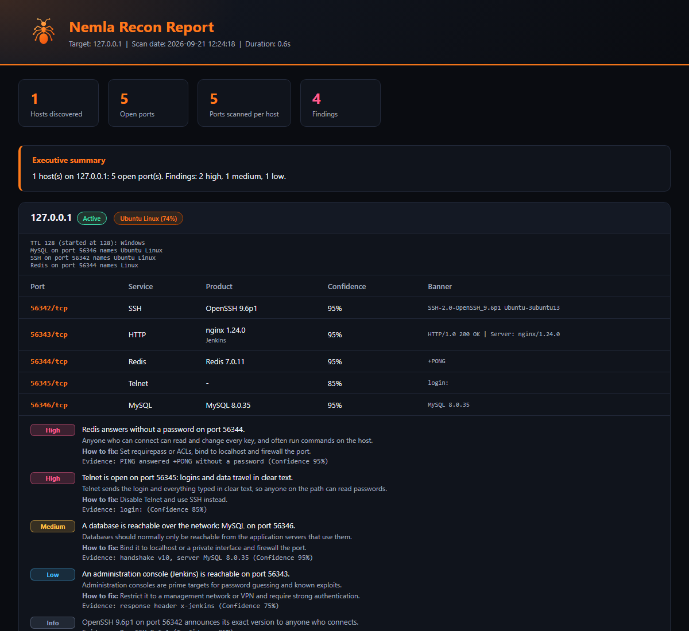

# 🐜 Nemla — Network Reconnaissance Tool

**Discover · Scan · Fingerprint · Report**

[](https://www.python.org/)
[](LICENSE)
[](https://github.com/hdada180/nmlah/actions/workflows/ci.yml)

**English** · [العربية](README.ar.md) · [עברית](README.he.md)

Nemla (Arabic: **نملة**, "ant") is a small, dependency-free network reconnaissance tool written in Python. Point it at an IP, a hostname, a range or a subnet and it finds live hosts, scans TCP ports, identifies what is running (products, versions, TLS certificates), makes a best-guess at the operating system, tells you in plain words what looks risky, and writes a clean **HTML report** (plus JSON and CSV for scripting). The interface and the report are available in **English, Arabic and Hebrew**.



> The screenshot is a scan of a local lab (`127.0.0.1`) running a few demo services. See [`nemla_report_sample.html`](nemla_report_sample.html) for the full report.

## Why Nemla?

[nmap](https://nmap.org) is far more powerful, and you should use it for serious work. Nemla is for the moments when you want something smaller:

- **Zero setup** — standard library only. The scanner is one Python file (`nemla.py`); the 3D interface and Guard mode live in an optional `nemla_ui/` folder next to it. Scapy is optional.
- **A report you can actually hand to someone** — a readable dark-mode HTML page, no XML converting.
- **Arabic and Hebrew** — `--lang ar` or `--lang he` switches the whole CLI, the report and the interface to right-to-left Arabic or Hebrew.
- **Readable source** — plain Python with no frameworks. Start at `main()` and `run_scan()` in `nemla.py`; a good part of that file is translation tables. That makes it good for learning how scanners work.

## What Nemla tells you

Besides open ports, Nemla identifies what is running and says what it means:

- **Products and versions** from banners and light probes (OpenSSH, nginx, Apache, vsftpd, Postfix, MySQL, PostgreSQL, Redis and more), plus web page titles.
- **TLS details:** protocol version, certificate subject and issuer, expiry date, and whether the certificate is self-signed.
- **Who made it.** When ARP discovery gives a MAC address, Nemla names the platform behind well-known prefixes (VMware, VirtualBox, Hyper-V, Xen, QEMU/KVM, Docker, Raspberry Pi). This is a small hand-picked list, not the full IEEE registry, so most addresses show no name.
- **Findings** in plain words, each rated high, medium, low or info: cleartext services such as Telnet and FTP, databases and remote-access ports that are reachable, Redis, Memcached or Elasticsearch answering without a password, expired or soon-to-expire certificates, obsolete TLS versions, websites without HTTPS. Exposure on a public IP address is rated higher than on a private network.
- Findings are observations only. Nemla never logs in, guesses passwords or exploits anything.

Use it in scripts and CI: the command below exits with code 3 when a finding at that level or above is present.

```bash
python3 nemla.py -t 10.0.0.0/24 --fail-on high
```

## What changed since last time

Nemla remembers your scans (the newest 60, in your Nemla data folder) and compares each new scan with the previous one of the same target: hosts that appeared or vanished, ports that opened or closed, services whose product or version changed, a different system guess, and findings that appeared or were resolved. In the 3D interface this shows as a card above the host list, new hosts pulse blue and vanished hosts stay behind as dashed outlines.

On the command line:

```bash
python3 nemla.py -t 192.168.1.0/24 --json today.json
```

```bash
python3 nemla.py --diff yesterday.json today.json
```

`--diff` prints the changes, and with `--fail-on-change` it exits with code 3 if something appeared (a host, an open port or a finding), which suits scheduled checks.

To keep an eye on a network, let Nemla scan again and again and report each change (stop with Ctrl+C):

```bash
python3 nemla.py -t 192.168.1.0/24 --watch 15m --watch-log changes.jsonl
```

The interval can be written as `90s`, `15m` or `2h` (at least 10 seconds). Every round is saved, so the next run continues from the last one.

## Guard mode (defensive)

Nemla can also watch a network instead of scanning it. Guard mode looks for three signs that something suspicious is going on inside your network:

- **Decoy ports.** Nemla opens a few ports that no legitimate device or person has any reason to touch (2222, 2323, 5901, 8888 and 3307 by default). Whatever connects to one is probing your network, and Nemla records who it was and what it sent. This gives very few false alarms.
- **Unknown devices.** The first check learns your devices by their hardware (MAC) address. After that, a device that was not there before raises an alert. When the address belongs to a well-known platform the alert names it (for example a Raspberry Pi or a virtual machine), and it says when the address is "locally administered", which is what virtual machines, containers and phones with a private Wi-Fi address use.
- **ARP changes.** If an address suddenly answers from a different device, above all your gateway, that is the classic trace of ARP spoofing (a man-in-the-middle).

Guard only watches and alerts. It never attacks back, never scans other machines on its own, and never changes your firewall: for a device you want to block it shows the exact command and leaves running it to you.

```bash
python3 nemla.py --guard
```

Or switch on **Guard** in the 3D interface: the screen flashes, the source glows red on the map, and every alert says what to do next. The interface only guards while it is open. For always-on protection run `nemla --guard` (for example on a Raspberry Pi), optionally with `--guard-log alerts.jsonl` so alerts are also saved as JSON lines.

Notes: decoy ports above 1024 need no special rights, and nothing in Guard needs root. Connections from the computer running Guard are ignored, and phones that randomise their Wi-Fi address can look like new devices.

## The 3D interface

Run Nemla with no arguments and it opens its own window: a 3D map of your network, a scan form, a live host list and a host inspector. It is the same scanner as the command line, just easier to work with.

```bash
python3 nemla.py            # opens the 3D interface
```

- **The colony view.** This computer is the nest in the middle, every discovered host floats around it, and each open port orbits its host, coloured by service type (web, remote access, database, mail, files). Drag to orbit, scroll to zoom, click a host to inspect it.
- **Live.** Hosts and ports appear while the scan runs. Stop keeps the partial results.
- **Risk at a glance.** Hosts with high or medium findings pulse rose or gold in the map, and the inspector lists every finding with its severity.
- **Export.** HTML report, JSON or CSV from the Export button.
- **English, Arabic and Hebrew**, right-to-left included, with a language menu.
- **Try it without scanning.** "Watch a demo colony" replays a made-up network.
- **Standard library only.** The interface is a small local web server plus one page. There is nothing to install and it works offline.

### Add Nemla to the Linux applications menu

```bash
python3 nemla.py --install-launcher     # menu entry, icon and a `nemla` command, all under ~/.local
python3 nemla.py --uninstall-launcher   # removes them again
```

Then open **Nemla** from your applications menu (or type `nemla`). In a Chromium-family browser (Chrome, Chromium, Brave, Edge) it opens as its own window without browser chrome, otherwise in your default browser. Closing the window stops Nemla.

ARP discovery needs root, and browsers refuse to start as root, so for that case run `sudo python3 nemla.py --no-browser` and open the printed address in your browser. Over SSH, forward the port (`ssh -L PORT:127.0.0.1:PORT host`) and open the address locally.

### How it stays safe

The interface listens on `127.0.0.1` only. Every request needs a random token that exists only in the link Nemla opens, and the `Host` and `Origin` headers are checked, so other websites and other machines cannot start scans. Scanned text (banners, OS strings) is shown as plain text, never as HTML, and the page runs under a strict Content-Security-Policy. The first scan asks you to confirm that you own the network or may test it.

### Identity

Nemla has its own logo, colours and type: see [`docs/brand.html`](docs/brand.html). The logo files live in [`nemla_ui/web/brand/`](nemla_ui/web/brand/).

## Install

```bash
git clone https://github.com/hdada180/nmlah.git
cd nmlah
python3 nemla.py --help
```

Optional, for ARP discovery on local networks and raw-ICMP TTL probing:

```bash
pip install scapy        # or: pip install -r requirements.txt
```

You can also install it as a command: `pip install .` (or `pip install ".[arp]"`), then run `nemla -t ...`.

## Quick start

```bash
# a whole subnet, common ports
sudo python3 nemla.py -t 192.168.1.0/24

# one host, ports 1-1000
python3 nemla.py -t 192.168.1.10 -p 1-1000

# ranges: short form or full form
python3 nemla.py -t 192.168.1.1-50
python3 nemla.py -t 192.168.1.1-192.168.2.20

# specific ports + JSON and CSV output
python3 nemla.py -t 192.168.1.10 -p 22,80,443 --json scan.json --csv scan.csv

# Arabic interface and report
python3 nemla.py -t 192.168.1.10 --lang ar

# target blocks ping? skip discovery (like nmap -Pn)
python3 nemla.py -t 192.168.1.10 --no-ping
```

`sudo` is only needed for ARP discovery and raw-ICMP TTL probing through Scapy. Without it, Nemla falls back to the system `ping` and plain TCP connections.

## Options

| Option | Description |
| --- | --- |
| `-t`, `--target` | IP, hostname, CIDR (`10.0.0.0/24`), short range (`10.0.0.1-50`) or full range (`10.0.0.1-10.0.0.50`) |
| `-p`, `--ports` | `22`, `22,80,443`, `1-1000` or a mix |
| `--top-ports` | Also scan the built-in list of common ports (this is the default when `-p` is omitted) |
| `-o`, `--output` | HTML report path (default `nemla_report.html`) |
| `--json FILE` | Also write the results as JSON |
| `--csv FILE` | Also write the results as CSV |
| `--no-ping` | Skip host discovery; treat every target as up |
| `--no-os` | Skip OS fingerprinting |
| `--no-banner` | Skip banner grabbing and service detection (versions, TLS, web titles) |
| `--fail-on LEVEL` | Exit with code 3 if any finding is at `low`, `medium` or `high` level or above |
| `--watch INTERVAL` | Scan again every `90s`, `15m` or `2h` and report what changed; stop with Ctrl+C |
| `--watch-log FILE` | Append every change found by `--watch` to a JSON-lines file |
| `--diff OLD.json NEW.json` | Compare two scans saved with `--json` and print what changed |
| `--fail-on-change` | With `--diff`: exit with code 3 if a host, an open port or a finding appeared |
| `--guard` | Watch the network for suspicious activity and print alerts until Ctrl+C |
| `--guard-ports LIST` | Decoy ports to open (default `2222,2323,5901,8888,3307`) |
| `--guard-interval SECONDS` | Seconds between device checks (default 60, `0` means decoy ports only) |
| `--guard-log FILE` | Also append alerts to a JSON-lines file |
| `--threads N` | Worker threads (default 150) |
| `--timeout S` | TCP connect timeout in seconds (default 0.7) |
| `--max-hosts N` | Refuse targets bigger than N addresses (default 1024) |
| `--lang en\|ar\|he` | Language of the CLI, the report and the interface (default `en`) |
| `--version` | Print the version |
| `--ui` | Open the 3D interface (also what happens with no arguments) |
| `--ui-port PORT` | Port for the local interface server (default: any free port) |
| `--no-browser` | Start the interface server without opening a window |
| `--keep-alive` | Keep the server running after its window is closed |
| `--install-launcher` / `--uninstall-launcher` | Linux: add or remove the applications-menu entry |

## How it works

1. **Discovery** — ARP on local networks (needs Scapy + root). If ARP finds nothing, or the target isn't local, Nemla falls back to ICMP (system `ping`) and TCP probes. A TCP connection *refused* still proves the host is alive.
2. **Port scan** — concurrent TCP connect scan (`ThreadPoolExecutor`). Service names come from a built-in table with a fallback to the system services database.
3. **Banner grabbing and detection** — Nemla listens first (SSH, FTP and SMTP greet you). If the port stays silent, it sends a harmless HTTP `HEAD`, but only on HTTP ports and ports with no known non-HTTP service. On open ports it then runs ordinary identification probes: a web `GET` for the page title, a TLS handshake for the certificate, Redis `PING`, Memcached `version`, a PostgreSQL SSL request. Nothing logs in and nothing changes state. Use `--no-banner` to skip all of it.
4. **OS guess** — heuristic: TTL (≤64 Linux/Unix/macOS, ≤128 Windows, otherwise network device) refined by open ports (RDP/SMB, SSH). Treat it as an estimate.
5. **Report** — HTML (all scanned data is HTML-escaped, since banners come from untrusted hosts), plus optional JSON/CSV.

## Limitations

- IPv4 only, TCP connect scan only (no SYN/UDP scanning).
- Findings describe exposure, not vulnerabilities: Nemla does not match versions against a CVE database.
- OS detection is a TTL-and-ports heuristic, not real fingerprinting.
- Firewalls that drop packets will make hosts look down. Try `--no-ping` and a larger `--timeout`.

## Responsible use

**Only scan systems and networks you own or have explicit written permission to test.** Unauthorized scanning may violate laws, provider terms and organizational policy. Nemla is a reconnaissance tool: it discovers and reports, it does not exploit anything, and that is intentional. The author is not responsible for misuse.

## Development

```bash
pip install pytest
python -m pytest -q
```

The tests run entirely against `127.0.0.1` with throw-away local servers. They also cover the interface server (token, host and origin checks, event stream, reports) and the Linux launcher.

## Roadmap

- [x] JSON and CSV output
- [x] English / Arabic / Hebrew interface
- [x] Service and version detection, TLS certificate details, findings and `--fail-on`
- [x] Guard mode: decoy ports, unknown devices and ARP changes
- [x] Scan history, "what changed" comparison, `--diff` and `--watch`
- [x] Unit and end-to-end tests, CI
- [x] 3D interface, Linux applications-menu launcher and the Nemla identity
- [ ] Browse and reopen past scans inside the interface (the comparison card and `/api/history` already exist)
- [ ] IPv6 support
- [x] MAC vendor names for well-known platforms (a small list; the full IEEE registry is still open)
- [ ] Scan profiles and a config file
- [ ] Richer service detection (plugin-based)
- [ ] Interactive HTML report (sorting, filtering)

## Contributing

Issues and pull requests are welcome. Please keep changes small, add a test where it makes sense, and keep the tool recon-only. When reporting a bug, include your OS, Python version, the command you ran, and the error output (without private IPs or credentials).

## License

[MIT](LICENSE) © hdada180

---

If Nemla is useful to you, a ⭐ helps other people find it.
